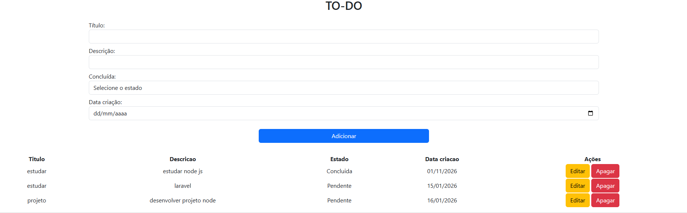

# TASK-MANAGER 

## 🏗 Arquitetura do projeto
API REST + Front separado

## 📌 Sobre o projeto

Aplicação criada para praticar integração entre frontend e backend, utilizando **JavaScript, Node.js e MySQL**.  
O sistema implementa um **CRUD completo de tarefas** com consumo de API e manipulação dinâmica do DOM.

## 🚀 Funcionalidades

- ➕ Adicionar novas tarefas  
- ✏️ Editar tarefas existentes  
- 🗑️ Remover tarefas  
- 📋 Listagem dinâmica das tarefas  
- 💾 Persistência dos dados no MySQL  
- 🔁 Comunicação via API REST com Node.js  

## 🛠 Tecnologias utilizadas

- **Frontend:**  
  - HTML  
  - CSS  
  - JavaScript  
  - Bootstrap  

- **Backend:**  
  - Node.js  
  - Express  

- **Banco de Dados:**  
  - MySQL  